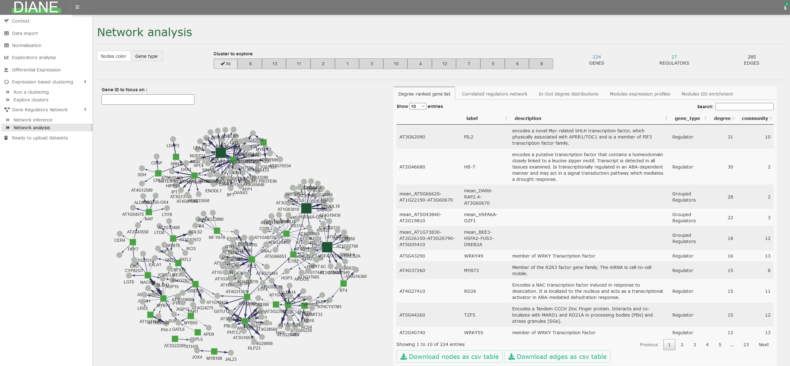

# Dashboard for the Inference and Analysis of Networks from Expression data 

## Application presentation

[DIANE](https://diane.ipsim.inrae.fr) is a R-Shiny application for the analysis of high throughput gene expression data (**RNA-Seq**). Its function is to extract important regulatory pathways involved in the response to environmental changes, or any perturbation inducing genomic modifications.

Given the popularity of combinatorial approaches in experimental biology, we designed this tool to process, explore, and perform advanced statistical analysis on **multifactorial expression data** using state of the art methods. It includes :

- Raw count data pre-processing and normalization

- Differential expression analysis and results visualization (Volcano plots, heatmaps, Venn diagrams...)

- Gene ontology enrichment analysis

- Expression based clustering in the framework of Mixture Models, and individual characterization of those clusters (generalized linar models and GO enrichment analysis).

- Machine learning based Gene Regulatory Network inference and interactive network analysis, community discovery, transcription factor ranking...

- Session reporting and results to download at each step of the pipeline

- Demonstration on a published dataset, and other ready to explore datasets on several organisms

All of the features in DIANE are accessible via a single page Shiny application that can be locally launched, or used online. Several versions of the application are available :

- The official published version : https://diane.ipsim.inrae.fr/DIANE 
- An updated version, continued from the aforementioned version : https://diane.ipsim.inrae.fr/DIANE_latest/



For users more familiar with R programming, all server-side functions in DIANE are exported so they can be called from R scripts. Those functions documentation can be found in the [Reference](https://alexandre-so.github.io/DIANE/reference/index.html), and are illustrated in the [corresponding vignette](https://alexandre-so.github.io/DIANE/articles/DIANE_Programming_Interface.html)

**To cite DIANE in publications use:**

  Cassan, O., Lèbre, S. & Martin, A. Inferring and analyzing gene regulatory networks from multi-factorial expression
  data: a complete and interactive suite. BMC Genomics 22, 387 (2021). https://doi.org/10.1186/s12864-021-07659-2

**A BibTeX entry for LaTeX users is**

```bibtex
@Article{cassan2021Inferring,
    title = {Inferring and analyzing gene regulatory networks from multi-factorial expression data: a complete and interactive suite},
    author = {Océane Cassan and Sophie Lèbre and Antoine Martin},
    journal = {BMC Genomics},
    year = {2021},
    volume = {22},
    number = {387},
    url = {https://bmcgenomics.biomedcentral.com/articles/10.1186/s12864-021-07659-2}}
```

## Use DIANE locally

DIANE is built and tested on R 4.6.1, available for all OS at <https://cloud.r-project.org/>.

Download and install DIANE in your R console as follows (you need the remotes package installed `install.packages("remotes")`) :

```r
remotes::install_github("Alexandre-So/DIANE")
```

You can then launch the application :

```r
library(DIANE)
DIANE::run_app()
```

In case your expression input file exceeds 5MB, you may need to run the command `options(shiny.maxRequestSize=30*1024^2)` before calling `DIANE::run_app()` to upload up to 30MB.

Once the application is launched, if the resolution poorly fits your screen, you can adjust it with the keyboard shortcuts `ctrl +` or `ctrl -` (use `cmd` on Mac).


**Note for Debian and Ubuntu users** : DIANE's dependencies need a number of system libraries. `Dockerfile.base` holds the up to date list :

```bash
sudo apt-get install cmake gdal-bin jags libabsl-dev libcurl4-openssl-dev \
  libgdal-dev libgeos-dev libgeos++-dev libglpk-dev libgmp-dev libicu-dev \
  libproj-dev libsqlite3-dev libssl-dev libudunits2-dev libuv1-dev \
  libxml2-dev make pandoc zlib1g-dev
```


## Deploy DIANE with Docker

The build has two steps. `Dockerfile.base` installs R, the system libraries and every package DIANE depends on : about an hour, and only again when `DESCRIPTION` changes. `Dockerfile.app` adds DIANE on top in about a minute, as one of two variants — **public**, self-contained, or **server**, which serves a directory you mount.

`build.sh` drives both, and checks the machine before it builds anything. `./build.sh --check` runs the checks alone.

Install the Docker engine as described in the [Docker docs](https://docs.docker.com/engine/install/), then :

```bash
git clone https://github.com/Alexandre-So/DIANE.git
cd DIANE
./build.sh --base
```

### Self-contained image

```bash
./build.sh --public
docker run --rm -p 8086:8086 diane:1.3-public
```

DIANE is then at <http://localhost:8086>, with the organisms bundled in the package. Nothing to mount.

### Served from a mounted directory

The image serves whatever sits on `/srv/shiny-server`, so the code can be updated without rebuilding, as long as no dependency changed.

```bash
./build.sh
docker run -d --rm --cpus 16 -p 8086:8086 \
  -v /path/to/DIANE/:/srv/shiny-server/ \
  -v /path/to/logs/:/var/log/shiny-server/ \
  diane:1.3
```

- `/path/to/DIANE/` is the clone on the host, the directory holding `app.R`.
- `/path/to/logs/` is where shiny-server writes its logs.
- `-p 8086:8086` is the port ; change the first number to serve on another one.
- `--cpus 16` is how many cores one session may use, `--memory 8g` caps its memory.
- `-d` detaches the container, `--rm` removes it when it stops.

Do not pass `--user` : the container starts as root and shiny-server drops to the `shiny` account itself, as set by `run_as` in `shiny-customized.config`. Give that account its rights, reading its ids from the image rather than assuming them :

```bash
docker run --rm --entrypoint sh diane:1.3 -c 'id shiny'
chmod -R a+rX /path/to/DIANE
chown -R <uid>:<gid> /path/to/DIANE/logs
```

### Serving your own organisms

Mount the dataset over the served directory :

```bash
docker run -d --rm -p 8086:8086 \
  -v /path/to/DIANE/:/srv/shiny-server/ \
  -v /path/to/dataset/data/:/srv/shiny-server/data/ \
  -v /path/to/dataset/inst/extdata/organisms/:/srv/shiny-server/inst/extdata/organisms/ \
  -v /path/to/logs/:/var/log/shiny-server/ \
  diane:1.3
```

Mounting `data/` replaces the whole directory, so the dataset must also carry `abiotic_stresses.rda`, `gene_annotations.rda` and `regulators_per_organism.rda`. A `.Rprofile` or a `renv/` directory must never reach the served directory : R reads them at startup and no session opens.

`./build.sh --check --data-dir /path/to/dataset` verifies all of this before building.

Behind ShinyProxy, the same mounts go into `application.yml` as `container-volumes`, with `container-cpu-limit` and `container-memory-limit`.

------------------------------------------------------------------------

## License


Copyright (C) 2020 Oceane Cassan

This program is free software: you can redistribute it and/or modify
it under the terms of the GNU General Public License as published by
the Free Software Foundation, either version 3 of the License, or
(at your option) any later version.

This program is distributed in the hope that it will be useful,
but WITHOUT ANY WARRANTY; without even the implied warranty of
MERCHANTABILITY or FITNESS FOR A PARTICULAR PURPOSE.  See the
GNU General Public License for more details.

You should have received a copy of the GNU General Public License
along with this program.  If not, see <http://www.gnu.org/licenses/>.

------------------------------------------------------------------------

Authors of the published work : Océane Cassan, Antoine Martin, Sophie Lèbre.

The application is now maintained by Alexandre Soriano (CIRAD)